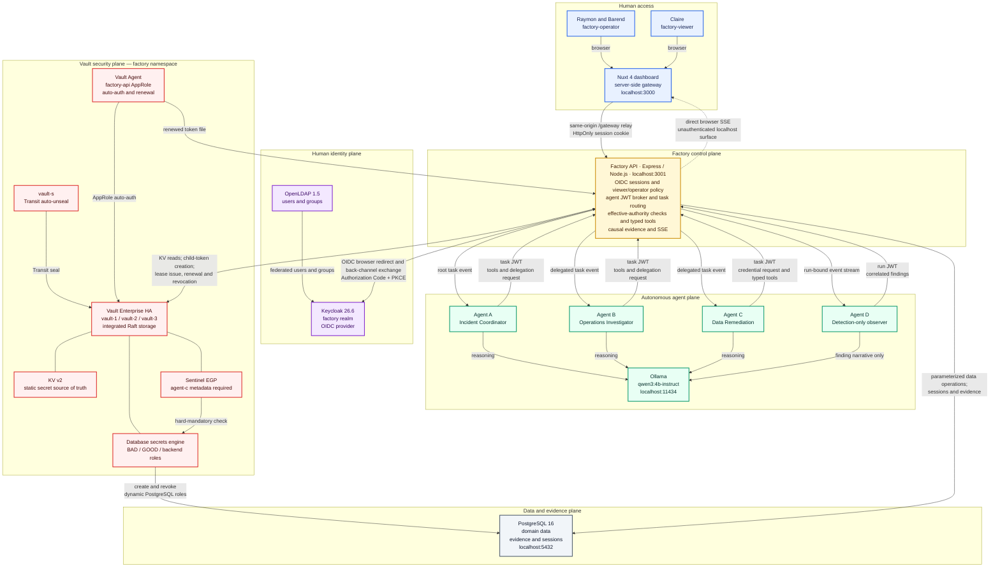
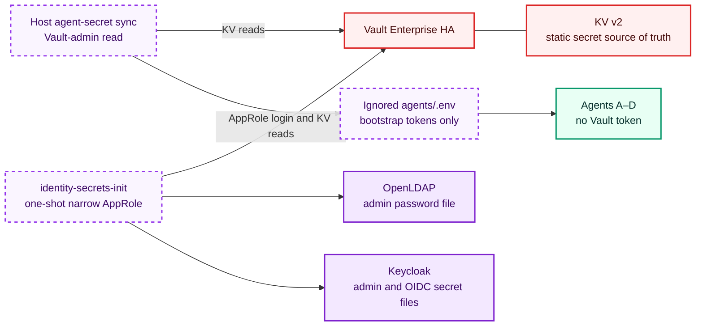
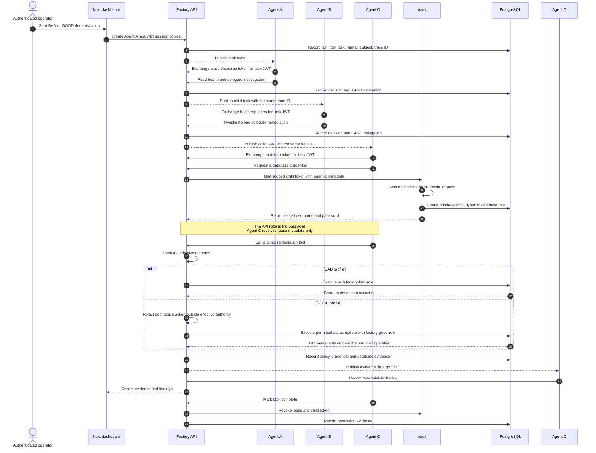

# Architecture diagram

This document maps the implemented Factory system as of the `2026-09-20_vault-kv-secrets-migration-complete` state baseline. The first diagram shows runtime traffic. A separate diagram isolates startup-only secret delivery so those paths are not confused with agent runtime access.

## System architecture

## Controlled startup paths

These paths run before normal agent work. The agent containers remain Vault-blind.

## Runtime authority flow

## Identity and authorization boundaries

| Identity domain | Credential presented at runtime | Enforced boundary |
| --- | --- | --- |
| Raymon and Barend | Keycloak-authenticated, opaque Factory session cookie | `factory-operator`: dashboard reads and demo controls |
| Claire | Keycloak-authenticated, opaque Factory session cookie | `factory-viewer`: dashboard reads; no start, profile switch, or reset |
| Agent A, B, and C | Short-lived JWT bound to actor, active run, and active task | Agent tool schema, JWT validation, fixed delegation graph, API policy |
| Agent D | Short-lived JWT bound to actor and current run | Detection and finding creation only |
| Factory API | Vault Agent-renewed AppRole token | Factory API ACL policy and Sentinel |
| Identity secret bootstrap job | Separate, narrow AppRole token | Read-only access to identity bootstrap secrets |
| PostgreSQL dynamic role | Vault-issued username and password retained by the API | BAD or GOOD database grants and lease lifetime |

The static per-agent bearer token is a bootstrap credential only. It can request a task-bound or run-bound JWT from `/api/v1/agents/token`; it cannot call agent tools, delegate, or request a database credential directly.

## Network placement

| Network or boundary | Members |
| --- | --- |
| `factory-control` | UI, API, OpenLDAP, Keycloak, PostgreSQL, Ollama, Agents A–D |
| `factory-vault-internal` | Vault HA cluster, Vault Agent, API, one-shot identity secret bootstrap job |
| Host-published endpoints | UI `3000`, API `3001`, PostgreSQL `5432`, Ollama `11434`, Keycloak `8088`, LDAP admin `8085`, Vault `18190` and `18200–18202`; all bind to `127.0.0.1` |

The API and identity secret bootstrap job bridge the control and Vault networks for their defined purposes. Agent containers do not receive a Vault token, a PostgreSQL password, an arbitrary SQL tool, or a host filesystem mount.

## Accuracy notes

- The dashboard shell and state-changing control routes require a human session. Raymon and Barend are operators; Claire is a viewer.
- Browser API calls use the Nuxt `/gateway` route so the HTTP-only session cookie remains same-origin.
- The browser-facing OIDC login and callback also pass through `/gateway`. The Factory API owns PKCE state, callback validation, and the back-channel token exchange with Keycloak.
- The browser's live SSE connection currently goes directly to `localhost:3001/api/events/stream`. The SSE and historical telemetry routes remain unauthenticated localhost surfaces; the diagram does not present them as session-protected.
- Vault KV is the source of truth for static secrets. The API reads its secrets directly, third-party identity containers receive files from a one-shot bootstrap job, and Vault-blind agent containers receive only their bootstrap token through the host sync path.
- BAD and GOOD use the same Agent C code and typed tools. BAD deliberately assigns the unsafe ceiling and broad database role. GOOD intersects the requested envelope with the recipient ceiling and uses the bounded role.
- Ollama supplies reasoning and Agent D narrative text. Deterministic code controls identity, authorization, credential brokerage, database execution, and finding severity.
- `factory-control` is a local demo network, not a production egress-control boundary.

## Source map

| Diagram area | Authoritative implementation |
| --- | --- |
| Human identity and groups | `compose/identity/`, `backend/src/auth/`, `ui/app/middleware/auth.global.ts` |
| Nuxt gateway and session relay | `ui/server/routes/gateway/`, `ui/app/composables/useDemoApi.ts` |
| Agent identity | `backend/src/auth/agentJwt.js`, `backend/src/middleware/agentJwtAuth.js`, `backend/src/routes/agentToken.js` |
| Delegation and authority | `backend/src/routes/delegations.js`, `backend/src/policy.js` |
| Vault brokerage | `compose/vault/`, `backend/src/vault.js`, `terraform/vault-platform/`, `terraform/vault-sentinel/` |
| Dynamic PostgreSQL roles | `terraform/vault-database/`, `backend/src/routes/credentials.js` |
| Evidence and detection | `backend/src/audit.js`, `backend/src/routes/events.js`, `agents/identities/agent-d.js` |
| Static secret delivery | `terraform/vault-secrets/`, `scripts/agents-secrets-sync.sh`, `compose/identity/identity-secrets/` |
